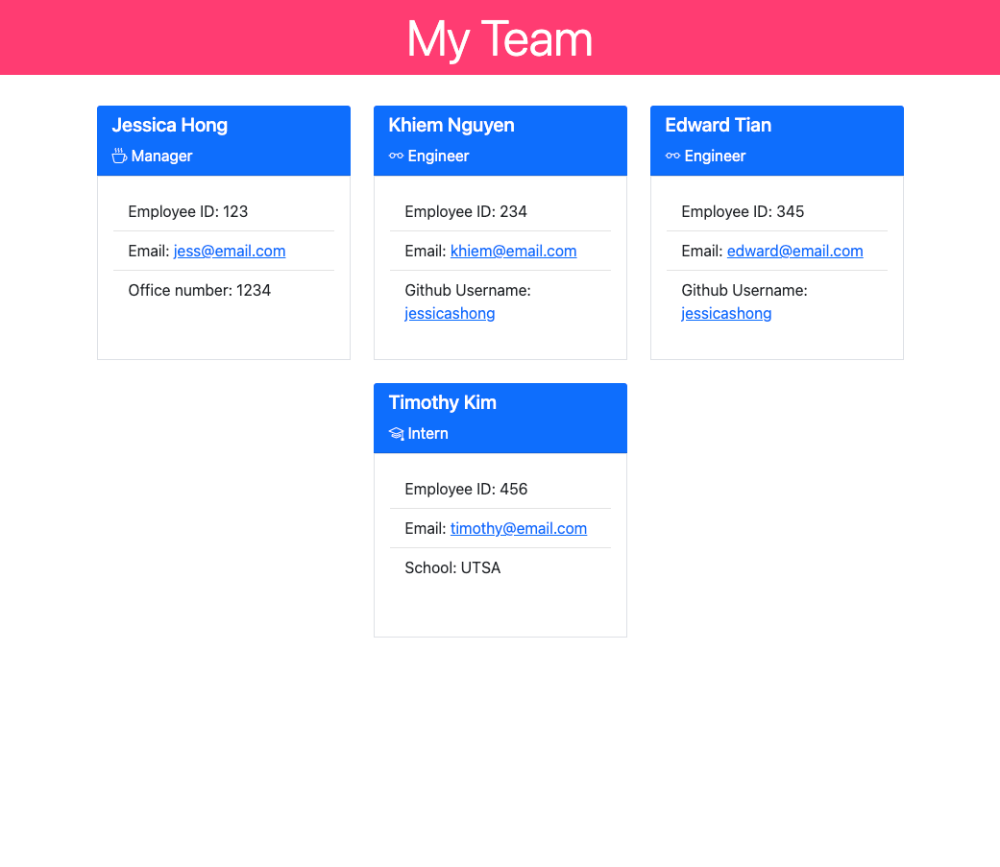

# Team Profile Generator

## Description
This is a command line application that accepts user input to generate a team profile for the user. Once the user finishes answering prompts in the command line, the app will create an HTML file containing the team members' profiles.

## Table of contents
- [Installation](#installation)
- [Usage](#usage)
- [Visual Presentation](#visual-presentation)
- [Tests](#tests)
- [Links](#links)

## Installation
Node, npm, and jest are required to run this application. 
Visit https://nodejs.org/en/download/ to install the latest version of Node.js and npm. Run `npm install jest` to add jest to the package.json.

## Usage
Once Node and npm are installed, run `node index.js` in the command line to begin answering prompts. Answer all prompts thoroughly.

## Visual Presentation
[sampleHTML Walkthrough Video](https://drive.google.com/file/d/1oPi5Kc2HBamPVaUzBwHtnHRU4z3Z-Dok/view)

## Tests
Test files are provided in the "tests" folder. Run `npm test` in the command line to test application.

## Links 
GitHub Repo: [https://github.com/jessicashong/team-profile-generator](https://github.com/jessicashong/team-profile-generator)

Sample HTML: [./dist/SAMPLE.html](./dist/SAMPLE.html)